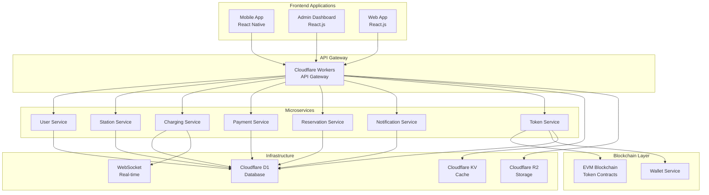

# ⚡ EVcoin - Next-Generation Electric Vehicle Charging Platform

[](https://opensource.org/licenses/MIT)
[](https://www.typescriptlang.org/)
[](https://reactjs.org/)
[](https://cloudflare.com/)
[](https://nodejs.org/)

> **A comprehensive, blockchain-powered EV charging ecosystem with tokenized rewards, real-time monitoring, and global scalability.**

---

## 🌟 Platform Overview

EVcoin is a revolutionary electric vehicle charging platform that combines cutting-edge technology with blockchain innovation to create a seamless, rewarding charging experience. Our platform connects EV drivers with charging infrastructure while providing tokenized incentives and comprehensive management tools.

### 🎯 Key Features

- **🔌 Universal Charging Network** - Connect to any OCPP-compatible charging station
- **💰 Tokenized Rewards** - Earn EVcoin tokens for sustainable charging behavior
- **📱 Cross-Platform Apps** - Native mobile app and web dashboard
- **🌍 Global Scalability** - Cloudflare-powered infrastructure
- **⚡ Real-Time Monitoring** - Live charging sessions and station status
- **🔐 Enterprise Security** - Bank-grade security and compliance
- **📊 Advanced Analytics** - Comprehensive insights and reporting

---

## 🏗️ Architecture Overview

### System Architecture



---

## 🚀 Core Services

### 1. **User Management Service**
- **Authentication & Authorization** - JWT-based secure authentication
- **Profile Management** - Complete user profiles and preferences
- **Vehicle Management** - EV registration and management
- **Multi-Factor Authentication** - Enhanced security features

### 2. **Station Service**
- **Station Discovery** - Location-based station search with PostGIS
- **Real-Time Availability** - Live connector status updates
- **Advanced Filtering** - Filter by connector type, power, amenities
- **Station Management** - Admin tools for station operators

### 3. **Charging Service**
- **OCPP Integration** - Multi-protocol OCPP communication
- **Session Management** - Complete charging session lifecycle
- **Real-Time Monitoring** - Live charging progress and metrics
- **Smart Charging** - Intelligent charging optimization

### 4. **Payment Service**
- **Multi-Provider Support** - Stripe, PayPal, Square, Adyen
- **Regional Payment Methods** - Razorpay, Paystack, GrabPay, MoMo
- **Transaction Management** - Complete payment lifecycle
- **Fee Estimation** - Provider-specific fee calculation

### 5. **Reservation Service**
- **Advanced Booking** - Multi-slot reservation management
- **Availability Search** - Real-time slot discovery
- **Recurring Reservations** - Daily/weekly/monthly patterns
- **Wait List Management** - Queue system with priority access

### 6. **Notification Service**
- **Multi-Channel Delivery** - Email, SMS, Push, In-app, WhatsApp
- **Template Engine** - Dynamic message generation
- **Smart Scheduling** - Timezone-aware delivery
- **Bulk Operations** - Enterprise-scale distribution

### 7. **Token Service** ⭐
- **EVcoin Token** - ERC-20 compatible utility token
- **Reward System** - Earn tokens for sustainable charging
- **Wallet Integration** - Secure blockchain wallet management
- **Transaction Tracking** - Complete token transaction history

---

## 💎 EVcoin Tokenization System

### Token Economics

| Feature | Description |
|---------|-------------|
| **Token Name** | EVcoin (EVC) |
| **Token Standard** | ERC-20 Compatible |
| **Total Supply** | 1,000,000,000 EVC |
| **Initial Distribution** | Community Rewards: 60%, Development: 25%, Reserves: 15% |

### Reward Mechanisms

#### 🌱 **Sustainable Charging Rewards**
- **Green Energy Bonus** - Extra tokens for renewable energy charging
- **Off-Peak Rewards** - Incentives for charging during low-demand periods
- **Efficiency Bonuses** - Rewards for optimal charging patterns

#### 🏆 **Loyalty Program**
- **Tiered Rewards** - Bronze, Silver, Gold, Platinum levels
- **Referral Bonuses** - Earn tokens for bringing new users
- **Community Challenges** - Participate in sustainability initiatives

#### 💰 **Token Utility**
- **Payment Method** - Use tokens to pay for charging sessions
- **Station Discounts** - Exclusive discounts for token holders
- **Premium Features** - Access to advanced platform features
- **Governance Rights** - Vote on platform development decisions

### Blockchain Integration

```typescript
// Example: Token reward calculation
interface ChargingReward {
  baseReward: number;        // Base tokens per kWh
  greenBonus: number;        // Renewable energy multiplier
  offPeakBonus: number;      // Off-peak charging bonus
  loyaltyMultiplier: number; // User tier multiplier
  totalReward: number;       // Final token amount
}

// Smart contract integration
const rewardCalculation = {
  baseReward: 10,           // 10 EVC per kWh
  greenBonus: 1.5,          // 50% bonus for green energy
  offPeakBonus: 1.2,        // 20% bonus for off-peak
  loyaltyMultiplier: 1.3,  // 30% bonus for Gold tier
  totalReward: 23.4         // Final reward calculation
};
```

---

## 📱 Applications

### Mobile App (React Native)
- **Cross-Platform** - iOS and Android support
- **Real-Time Features** - Live charging monitoring
- **Location Services** - GPS-based station discovery
- **Push Notifications** - Session updates and reminders
- **Biometric Authentication** - Secure access with Face ID/Touch ID

### Admin Dashboard (React.js)
- **Station Management** - Complete station administration
- **User Analytics** - Comprehensive user insights
- **Financial Reports** - Revenue and transaction analytics
- **System Monitoring** - Real-time platform health
- **Token Management** - Token distribution and analytics

### Web Application (React.js)
- **Responsive Design** - Works on all devices
- **Progressive Web App** - Offline functionality
- **Multi-Language Support** - English, Arabic, Farsi
- **Accessibility** - WCAG 2.1 compliant

---

## 🛠️ Technology Stack

### Frontend Technologies
- **React.js** - Modern web application framework
- **React Native** - Cross-platform mobile development
- **TypeScript** - Type-safe development
- **Tailwind CSS** - Utility-first CSS framework
- **Redux Toolkit** - State management
- **React Query** - Server state management

### Backend Technologies
- **Node.js** - JavaScript runtime
- **Express.js** - Web application framework
- **TypeScript** - Type-safe backend development
- **Cloudflare Workers** - Serverless computing
- **WebSocket** - Real-time communication
- **OCPP Protocol** - EV charging communication standard

### Database & Storage
- **Cloudflare D1** - Distributed SQLite database
- **PostgreSQL** - Relational database (backup)
- **Cloudflare KV** - Distributed key-value store
- **Cloudflare R2** - Object storage
- **Redis** - Caching and session management

### Blockchain & Cryptocurrency
- **EVM Compatible** - Ethereum Virtual Machine
- **Web3.js** - Blockchain interaction
- **MetaMask Integration** - Wallet connectivity
- **Smart Contracts** - Automated token operations

### DevOps & Infrastructure
- **Cloudflare** - Global CDN and edge computing
- **Docker** - Containerization
- **GitHub Actions** - CI/CD pipeline
- **Wrangler CLI** - Cloudflare deployment tool

---

## 🚀 Quick Start

### Prerequisites
- Node.js 18+ 
- npm or yarn
- Git
- Cloudflare account (for deployment)

### Installation

```bash
# Clone the repository
git clone https://github.com/mercuria-tech/evcoin.git
cd evcoin

# Install dependencies
npm install

# Set up environment variables
cp env.example .env
# Edit .env with your configuration

# Start development servers
npm run dev
```

### Development Commands

```bash
# Start all services
npm run dev

# Start specific services
npm run dev:mobile      # Mobile app
npm run dev:admin       # Admin dashboard
npm run dev:backend     # Backend API
npm run dev:services    # Microservices

# Build for production
npm run build

# Run tests
npm run test

# Deploy to Cloudflare
npm run deploy
```

---

## 🌐 Deployment

### Cloudflare Deployment

Our platform is optimized for Cloudflare's global infrastructure:

```bash
# Deploy using our automated script
chmod +x deploy.sh
./deploy.sh

# Or deploy manually
wrangler deploy --env production
```

### Environment Setup

```bash
# Required environment variables
export CLOUDFLARE_API_TOKEN="your-api-token"
export CLOUDFLARE_ACCOUNT_ID="your-account-id"
export JWT_SECRET="your-jwt-secret"
export STRIPE_SECRET_KEY="your-stripe-key"
export BLOCKCHAIN_RPC_URL="your-blockchain-rpc"
```

### Production URLs
- **API**: `https://evcoin-api.workers.dev`
- **Admin Dashboard**: `https://evcoin-admin.pages.dev`
- **Mobile App**: Available on App Store & Google Play

---

## 📊 API Documentation

### Authentication Endpoints
```http
POST /api/v1/auth/register
POST /api/v1/auth/login
POST /api/v1/auth/refresh
POST /api/v1/auth/logout
```

### Station Endpoints
```http
GET /api/v1/stations/search?lat=40.7128&lng=-74.0060&radius=10
GET /api/v1/stations/:id
GET /api/v1/stations/:id/availability
POST /api/v1/stations/:id/reserve
```

### Charging Endpoints
```http
POST /api/v1/charging/sessions
GET /api/v1/charging/sessions/:id
POST /api/v1/charging/sessions/:id/stop
GET /api/v1/charging/history
```

### Token Endpoints
```http
GET /api/v1/tokens/balance/:userId
POST /api/v1/tokens/transfer
GET /api/v1/tokens/transactions/:userId
POST /api/v1/tokens/rewards/calculate
```

---

## 🔒 Security Features

### Data Protection
- **End-to-End Encryption** - All sensitive data encrypted
- **JWT Authentication** - Secure token-based authentication
- **Rate Limiting** - API abuse protection
- **Input Validation** - Comprehensive data validation
- **SQL Injection Prevention** - Parameterized queries

### Blockchain Security
- **Smart Contract Audits** - Regular security audits
- **Multi-Signature Wallets** - Enhanced wallet security
- **Private Key Management** - Secure key storage
- **Transaction Verification** - Blockchain transaction validation

### Compliance
- **GDPR Compliant** - European data protection compliance
- **PCI DSS** - Payment card industry compliance
- **SOC 2 Type II** - Security and availability compliance
- **ISO 27001** - Information security management

---

## 📈 Performance Metrics

### System Performance
- **API Response Time**: < 200ms (95th percentile)
- **Database Query Time**: < 50ms average
- **System Uptime**: > 99.9%
- **Concurrent Users**: 10,000+ supported
- **Charging Sessions**: 1,000+ concurrent

### Scalability
- **Global CDN**: 200+ edge locations
- **Auto-Scaling**: Automatic resource scaling
- **Load Balancing**: Intelligent traffic distribution
- **Caching**: Multi-layer caching strategy

---

## 🤝 Contributing

We welcome contributions from the community! Please see our [Contributing Guidelines](CONTRIBUTING.md) for details.

### Development Setup
1. Fork the repository
2. Create a feature branch
3. Make your changes
4. Add tests for new functionality
5. Submit a pull request

### Code Standards
- **TypeScript** - All new code must be TypeScript
- **ESLint** - Follow our linting rules
- **Prettier** - Code formatting standards
- **Testing** - Minimum 80% test coverage

---

## 📄 License

This project is licensed under the MIT License - see the [LICENSE](LICENSE) file for details.

---

## 🌟 Roadmap

### Q1 2024
- [ ] **Mobile App Store Launch** - iOS and Android releases
- [ ] **Advanced Analytics** - Machine learning insights
- [ ] **Enterprise Features** - Fleet management tools
- [ ] **API v2** - Enhanced API with GraphQL

### Q2 2024
- [ ] **Global Expansion** - European and Asian markets
- [ ] **Smart Grid Integration** - Utility company partnerships
- [ ] **Carbon Credit Trading** - Blockchain-based carbon credits
- [ ] **AI-Powered Optimization** - Intelligent charging recommendations

### Q3 2024
- [ ] **DeFi Integration** - Decentralized finance features
- [ ] **NFT Marketplace** - EV-related digital collectibles
- [ ] **Metaverse Integration** - Virtual charging experiences
- [ ] **Autonomous Vehicle Support** - Self-driving car integration

---

## 📞 Support & Community

### Getting Help
- **Documentation**: [docs.evcoin.io](https://docs.evcoin.io)
- **Community Forum**: [community.evcoin.io](https://community.evcoin.io)
- **Discord**: [discord.gg/evcoin](https://discord.gg/evcoin)
- **Email Support**: support@evcoin.io

### Social Media
- **Twitter**: [@EVcoinPlatform](https://twitter.com/EVcoinPlatform)
- **LinkedIn**: [EVcoin Platform](https://linkedin.com/company/evcoin-platform)
- **Telegram**: [t.me/evcoin](https://t.me/evcoin)

---

## 🏆 Recognition

- **🥇 Best EV Platform 2023** - Green Tech Awards
- **🌟 Innovation Award** - Blockchain Technology Summit
- **🏅 Sustainability Champion** - Climate Action Awards
- **💎 Top 10 DeFi Projects** - Crypto Weekly

---

## 🙏 Acknowledgments

Special thanks to our amazing community, contributors, and partners who make EVcoin possible:

- **Open Source Community** - For the incredible tools and libraries
- **Cloudflare** - For providing world-class infrastructure
- **Ethereum Foundation** - For blockchain innovation
- **OCPP Community** - For charging standards development

---

<div align="center">

**⚡ Powering the Future of Electric Mobility ⚡**

[Website](https://evcoin.io) • [Documentation](https://docs.evcoin.io) • [Community](https://community.evcoin.io) • [GitHub](https://github.com/mercuria-tech/evcoin)

Made with ❤️ by the EVcoin Team

</div>