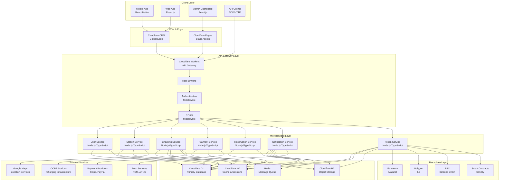
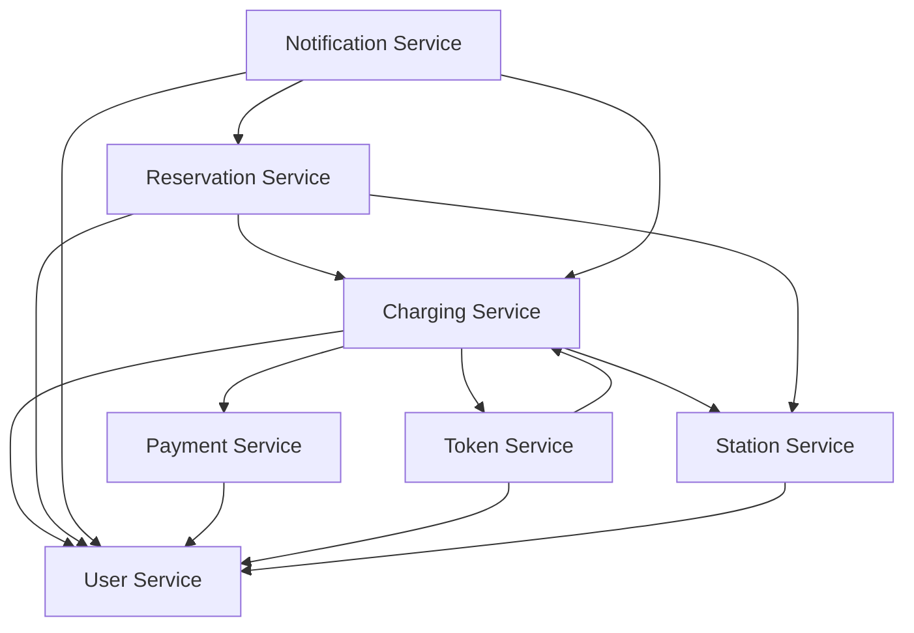

# 🏗️ EVcoin Platform Architecture

Comprehensive overview of the EVcoin platform architecture, including microservices, data flow, and system design principles.

## 📋 Table of Contents

- [Overview](#overview)
- [System Architecture](#system-architecture)
- [Microservices Design](#microservices-design)
- [Data Architecture](#data-architecture)
- [API Gateway](#api-gateway)
- [Real-time Communication](#real-time-communication)
- [Security Architecture](#security-architecture)
- [Scalability Design](#scalability-design)
- [Deployment Architecture](#deployment-architecture)

---

## 🌟 Overview

The EVcoin platform is built on a modern, cloud-native architecture designed for global scalability, high availability, and real-time performance. Our architecture follows microservices principles with event-driven communication and blockchain integration.

### Key Architectural Principles

- **Microservices Architecture** - Loosely coupled, independently deployable services
- **Event-Driven Design** - Asynchronous communication via events and WebSockets
- **Cloud-Native** - Built for cloud platforms with auto-scaling capabilities
- **API-First** - All functionality exposed through well-designed APIs
- **Security by Design** - Security integrated at every layer
- **Observability** - Comprehensive monitoring and logging

---

## 🏛️ System Architecture

### High-Level Architecture



### Architecture Layers

#### 1. **Client Layer**
- **Mobile App** - React Native cross-platform application
- **Web App** - React.js progressive web application
- **Admin Dashboard** - React.js management interface
- **API Clients** - SDKs and direct HTTP clients

#### 2. **CDN & Edge Layer**
- **Cloudflare CDN** - Global content delivery network
- **Cloudflare Pages** - Static site hosting
- **Edge Computing** - Serverless functions at edge locations

#### 3. **API Gateway Layer**
- **Cloudflare Workers** - Serverless API gateway
- **Rate Limiting** - Request throttling and abuse protection
- **Authentication** - JWT-based authentication middleware
- **CORS** - Cross-origin resource sharing

#### 4. **Microservices Layer**
- **User Service** - User management and authentication
- **Station Service** - Charging station management
- **Charging Service** - Charging session management
- **Payment Service** - Payment processing
- **Reservation Service** - Station reservation system
- **Notification Service** - Multi-channel notifications
- **Token Service** - Blockchain token management

#### 5. **Data Layer**
- **Cloudflare D1** - Primary SQLite database
- **Cloudflare KV** - Key-value cache and sessions
- **Cloudflare R2** - Object storage for files
- **Redis** - Message queue and real-time data

#### 6. **Blockchain Layer**
- **Multi-Chain Support** - Ethereum, Polygon, BSC
- **Smart Contracts** - Token distribution and management
- **Wallet Integration** - Web3 wallet connectivity

---

## 🔧 Microservices Design

### Service Communication Patterns

#### 1. **Synchronous Communication**
```typescript
// Direct HTTP calls between services
interface ServiceClient {
  baseURL: string;
  timeout: number;
  retries: number;
}

class UserServiceClient implements ServiceClient {
  baseURL = 'https://user-service.evcoin.io';
  timeout = 5000;
  retries = 3;
  
  async getUser(userId: string): Promise<User> {
    const response = await fetch(`${this.baseURL}/users/${userId}`, {
      method: 'GET',
      headers: { 'Authorization': `Bearer ${this.token}` }
    });
    return response.json();
  }
}
```

#### 2. **Asynchronous Communication**
```typescript
// Event-driven communication via Redis
interface EventBus {
  publish(event: Event): Promise<void>;
  subscribe(eventType: string, handler: EventHandler): void;
}

class RedisEventBus implements EventBus {
  private redis: Redis;
  
  async publish(event: Event): Promise<void> {
    await this.redis.publish('events', JSON.stringify(event));
  }
  
  subscribe(eventType: string, handler: EventHandler): void {
    this.redis.subscribe('events');
    this.redis.on('message', (channel, message) => {
      const event = JSON.parse(message);
      if (event.type === eventType) {
        handler(event);
      }
    });
  }
}
```

#### 3. **WebSocket Communication**
```typescript
// Real-time communication for charging sessions
class ChargingWebSocketService {
  private connections: Map<string, WebSocket> = new Map();
  
  broadcastToUser(userId: string, message: any): void {
    const connection = this.connections.get(userId);
    if (connection && connection.readyState === WebSocket.OPEN) {
      connection.send(JSON.stringify(message));
    }
  }
  
  broadcastToStation(stationId: string, message: any): void {
    // Broadcast to all users connected to a station
    this.connections.forEach((connection, userId) => {
      if (this.isUserConnectedToStation(userId, stationId)) {
        connection.send(JSON.stringify(message));
      }
    });
  }
}
```

### Service Dependencies



### Service Responsibilities

#### User Service
- **Authentication** - Login, registration, password management
- **User Profiles** - Profile management, preferences
- **Vehicle Management** - EV registration and management
- **Authorization** - Role-based access control

#### Station Service
- **Station Discovery** - Location-based search
- **Station Management** - CRUD operations
- **Availability Tracking** - Real-time connector status
- **Station Analytics** - Usage statistics and reporting

#### Charging Service
- **Session Management** - Start, monitor, stop sessions
- **OCPP Integration** - Communication with charging stations
- **Real-time Monitoring** - Live session updates
- **Session Analytics** - Charging patterns and optimization

#### Payment Service
- **Payment Processing** - Multi-provider payment handling
- **Transaction Management** - Payment history and reconciliation
- **Billing** - Invoice generation and management
- **Refund Processing** - Automated refund handling

#### Reservation Service
- **Booking Management** - Station reservation system
- **Availability Checking** - Real-time slot availability
- **Cancellation Handling** - Flexible cancellation policies
- **Wait List Management** - Queue system for popular stations

#### Notification Service
- **Multi-Channel Delivery** - Email, SMS, push, in-app
- **Template Management** - Dynamic message templates
- **Delivery Tracking** - Notification analytics
- **User Preferences** - Notification settings management

#### Token Service
- **Token Distribution** - Automated reward distribution
- **Wallet Management** - Blockchain wallet integration
- **Transaction Tracking** - Token transaction history
- **Reward Calculation** - Dynamic reward algorithms

---

## 💾 Data Architecture

### Database Design

#### Primary Database (Cloudflare D1)
```sql
-- Users table
CREATE TABLE users (
  id TEXT PRIMARY KEY,
  email TEXT UNIQUE NOT NULL,
  password_hash TEXT NOT NULL,
  name TEXT NOT NULL,
  phone TEXT,
  tier TEXT DEFAULT 'bronze',
  wallet_address TEXT,
  created_at DATETIME DEFAULT CURRENT_TIMESTAMP,
  updated_at DATETIME DEFAULT CURRENT_TIMESTAMP
);

-- Stations table
CREATE TABLE stations (
  id TEXT PRIMARY KEY,
  name TEXT NOT NULL,
  address TEXT NOT NULL,
  latitude REAL NOT NULL,
  longitude REAL NOT NULL,
  operator TEXT NOT NULL,
  status TEXT DEFAULT 'active',
  amenities TEXT, -- JSON array
  created_at DATETIME DEFAULT CURRENT_TIMESTAMP
);

-- Connectors table
CREATE TABLE connectors (
  id TEXT PRIMARY KEY,
  station_id TEXT NOT NULL,
  type TEXT NOT NULL, -- CCS, Type2, CHAdeMO, Tesla
  power REAL NOT NULL, -- kW
  status TEXT DEFAULT 'available',
  price_per_kwh REAL NOT NULL,
  FOREIGN KEY (station_id) REFERENCES stations(id)
);

-- Charging sessions table
CREATE TABLE charging_sessions (
  id TEXT PRIMARY KEY,
  user_id TEXT NOT NULL,
  station_id TEXT NOT NULL,
  connector_id TEXT NOT NULL,
  vehicle_id TEXT,
  start_time DATETIME NOT NULL,
  end_time DATETIME,
  energy_delivered REAL DEFAULT 0,
  cost REAL DEFAULT 0,
  status TEXT DEFAULT 'active',
  ocpp_transaction_id TEXT,
  FOREIGN KEY (user_id) REFERENCES users(id),
  FOREIGN KEY (station_id) REFERENCES stations(id),
  FOREIGN KEY (connector_id) REFERENCES connectors(id)
);

-- Token transactions table
CREATE TABLE token_transactions (
  id TEXT PRIMARY KEY,
  user_id TEXT NOT NULL,
  amount REAL NOT NULL,
  type TEXT NOT NULL, -- reward, payment, transfer
  description TEXT,
  transaction_hash TEXT,
  blockchain TEXT, -- ethereum, polygon, bsc
  created_at DATETIME DEFAULT CURRENT_TIMESTAMP,
  FOREIGN KEY (user_id) REFERENCES users(id)
);
```

#### Caching Strategy (Cloudflare KV)
```typescript
interface CacheStrategy {
  stations: {
    ttl: 300; // 5 minutes
    key: 'stations:all';
  };
  userProfile: {
    ttl: 3600; // 1 hour
    key: 'user:profile:';
  };
  tokenBalance: {
    ttl: 60; // 1 minute
    key: 'tokens:balance:';
  };
  stationAvailability: {
    ttl: 30; // 30 seconds
    key: 'station:availability:';
  };
}

class CacheManager {
  async get<T>(key: string): Promise<T | null> {
    const cached = await KV.get(key);
    return cached ? JSON.parse(cached) : null;
  }
  
  async set(key: string, value: any, ttl: number): Promise<void> {
    await KV.put(key, JSON.stringify(value), { expirationTtl: ttl });
  }
  
  async invalidate(pattern: string): Promise<void> {
    const keys = await KV.list({ prefix: pattern });
    await Promise.all(keys.keys.map(key => KV.delete(key.name)));
  }
}
```

### Data Flow Patterns

#### 1. **Read-Heavy Operations**
```typescript
// Station search with caching
async function searchStations(params: SearchParams): Promise<Station[]> {
  const cacheKey = `stations:search:${JSON.stringify(params)}`;
  
  // Try cache first
  const cached = await cache.get<Station[]>(cacheKey);
  if (cached) return cached;
  
  // Query database
  const stations = await database.stations.search(params);
  
  // Cache result
  await cache.set(cacheKey, stations, 300);
  
  return stations;
}
```

#### 2. **Write-Heavy Operations**
```typescript
// Charging session updates
async function updateChargingSession(sessionId: string, data: SessionUpdate): Promise<void> {
  // Update database
  await database.sessions.update(sessionId, data);
  
  // Invalidate cache
  await cache.invalidate(`session:${sessionId}`);
  
  // Publish event
  await eventBus.publish({
    type: 'charging_session_updated',
    sessionId,
    data
  });
  
  // Broadcast to WebSocket clients
  await websocketService.broadcastToSession(sessionId, data);
}
```

#### 3. **Real-time Data**
```typescript
// Station availability updates
class StationAvailabilityService {
  async updateAvailability(stationId: string, availability: Availability): Promise<void> {
    // Update database
    await database.stations.updateAvailability(stationId, availability);
    
    // Update cache
    await cache.set(`station:availability:${stationId}`, availability, 30);
    
    // Broadcast to connected clients
    await websocketService.broadcastToStation(stationId, {
      type: 'availability_updated',
      stationId,
      availability
    });
  }
}
```

---

## 🌐 API Gateway

### Cloudflare Workers Architecture

```typescript
// API Gateway implementation
export default {
  async fetch(request: Request, env: Env): Promise<Response> {
    const url = new URL(request.url);
    const path = url.pathname;
    
    // CORS handling
    if (request.method === 'OPTIONS') {
      return handleCORS(request);
    }
    
    // Rate limiting
    const rateLimitResult = await checkRateLimit(request, env);
    if (!rateLimitResult.allowed) {
      return new Response('Rate limit exceeded', { status: 429 });
    }
    
    // Authentication
    const authResult = await authenticate(request, env);
    if (!authResult.authenticated) {
      return new Response('Unauthorized', { status: 401 });
    }
    
    // Route to appropriate service
    const service = determineService(path);
    const response = await routeToService(service, request, env);
    
    // Add security headers
    return addSecurityHeaders(response);
  }
};

function determineService(path: string): string {
  if (path.startsWith('/api/v1/auth')) return 'user-service';
  if (path.startsWith('/api/v1/stations')) return 'station-service';
  if (path.startsWith('/api/v1/charging')) return 'charging-service';
  if (path.startsWith('/api/v1/payments')) return 'payment-service';
  if (path.startsWith('/api/v1/reservations')) return 'reservation-service';
  if (path.startsWith('/api/v1/notifications')) return 'notification-service';
  if (path.startsWith('/api/v1/tokens')) return 'token-service';
  throw new Error('Unknown service');
}
```

### Request Routing

```typescript
async function routeToService(service: string, request: Request, env: Env): Promise<Response> {
  const serviceUrls = {
    'user-service': env.USER_SERVICE_URL,
    'station-service': env.STATION_SERVICE_URL,
    'charging-service': env.CHARGING_SERVICE_URL,
    'payment-service': env.PAYMENT_SERVICE_URL,
    'reservation-service': env.RESERVATION_SERVICE_URL,
    'notification-service': env.NOTIFICATION_SERVICE_URL,
    'token-service': env.TOKEN_SERVICE_URL
  };
  
  const serviceUrl = serviceUrls[service];
  if (!serviceUrl) {
    throw new Error(`Service ${service} not configured`);
  }
  
  // Forward request to service
  const serviceRequest = new Request(serviceUrl + request.url, {
    method: request.method,
    headers: request.headers,
    body: request.body
  });
  
  return fetch(serviceRequest);
}
```

---

## 🔌 Real-time Communication

### WebSocket Architecture

```typescript
// WebSocket service implementation
export class WebSocketService {
  private connections: Map<string, WebSocket> = new Map();
  private userConnections: Map<string, Set<string>> = new Map();
  private stationConnections: Map<string, Set<string>> = new Map();
  
  async handleConnection(websocket: WebSocket, userId: string): Promise<void> {
    const connectionId = generateConnectionId();
    this.connections.set(connectionId, websocket);
    
    // Track user connections
    if (!this.userConnections.has(userId)) {
      this.userConnections.set(userId, new Set());
    }
    this.userConnections.get(userId)!.add(connectionId);
    
    // Handle messages
    websocket.addEventListener('message', (event) => {
      this.handleMessage(connectionId, event.data);
    });
    
    // Handle disconnection
    websocket.addEventListener('close', () => {
      this.handleDisconnection(connectionId, userId);
    });
  }
  
  async broadcastToUser(userId: string, message: any): Promise<void> {
    const connections = this.userConnections.get(userId);
    if (!connections) return;
    
    const messageStr = JSON.stringify(message);
    for (const connectionId of connections) {
      const websocket = this.connections.get(connectionId);
      if (websocket && websocket.readyState === WebSocket.OPEN) {
        websocket.send(messageStr);
      }
    }
  }
  
  async broadcastToStation(stationId: string, message: any): Promise<void> {
    const connections = this.stationConnections.get(stationId);
    if (!connections) return;
    
    const messageStr = JSON.stringify(message);
    for (const connectionId of connections) {
      const websocket = this.connections.get(connectionId);
      if (websocket && websocket.readyState === WebSocket.OPEN) {
        websocket.send(messageStr);
      }
    }
  }
}
```

### Event Types

```typescript
interface WebSocketEvent {
  type: string;
  data: any;
  timestamp: string;
}

// Charging session events
interface ChargingSessionEvent extends WebSocketEvent {
  type: 'charging_session_update';
  data: {
    sessionId: string;
    status: 'starting' | 'charging' | 'completed' | 'error';
    energyDelivered: number;
    currentPower: number;
    cost: number;
    progress: {
      percentage: number;
      remainingTime: number;
    };
  };
}

// Station availability events
interface StationAvailabilityEvent extends WebSocketEvent {
  type: 'station_availability_update';
  data: {
    stationId: string;
    connectors: Array<{
      id: string;
      status: 'available' | 'occupied' | 'maintenance';
      currentSession?: string;
    }>;
  };
}

// Token reward events
interface TokenRewardEvent extends WebSocketEvent {
  type: 'token_reward';
  data: {
    sessionId: string;
    rewardAmount: number;
    reason: string;
    newBalance: number;
  };
}
```

---

## 🔒 Security Architecture

### Multi-Layer Security

```typescript
// Security middleware stack
export class SecurityMiddleware {
  async authenticate(request: Request): Promise<AuthResult> {
    const token = this.extractToken(request);
    if (!token) {
      return { authenticated: false, error: 'No token provided' };
    }
    
    try {
      const payload = jwt.verify(token, process.env.JWT_SECRET);
      return { authenticated: true, user: payload };
    } catch (error) {
      return { authenticated: false, error: 'Invalid token' };
    }
  }
  
  async authorize(user: User, resource: string, action: string): Promise<boolean> {
    const permissions = await this.getUserPermissions(user.id);
    return permissions.some(p => p.resource === resource && p.actions.includes(action));
  }
  
  async validateInput(data: any, schema: any): Promise<ValidationResult> {
    try {
      await schema.validate(data);
      return { valid: true };
    } catch (error) {
      return { valid: false, errors: error.errors };
    }
  }
}
```

### Security Headers

```typescript
function addSecurityHeaders(response: Response): Response {
  const headers = new Headers(response.headers);
  
  // Security headers
  headers.set('X-Content-Type-Options', 'nosniff');
  headers.set('X-Frame-Options', 'DENY');
  headers.set('X-XSS-Protection', '1; mode=block');
  headers.set('Strict-Transport-Security', 'max-age=31536000; includeSubDomains');
  headers.set('Content-Security-Policy', "default-src 'self'");
  headers.set('Referrer-Policy', 'strict-origin-when-cross-origin');
  
  return new Response(response.body, {
    status: response.status,
    statusText: response.statusText,
    headers
  });
}
```

### Rate Limiting

```typescript
class RateLimiter {
  async checkLimit(request: Request, env: Env): Promise<RateLimitResult> {
    const clientId = this.getClientId(request);
    const key = `rate_limit:${clientId}`;
    
    const current = await env.KV.get(key);
    const count = current ? parseInt(current) : 0;
    
    if (count >= 1000) { // 1000 requests per hour
      return { allowed: false, remaining: 0, resetTime: Date.now() + 3600000 };
    }
    
    await env.KV.put(key, (count + 1).toString(), { expirationTtl: 3600 });
    
    return { 
      allowed: true, 
      remaining: 1000 - count - 1, 
      resetTime: Date.now() + 3600000 
    };
  }
}
```

---

## 📈 Scalability Design

### Horizontal Scaling

```typescript
// Auto-scaling configuration
interface ScalingConfig {
  minInstances: number;
  maxInstances: number;
  targetCPUUtilization: number;
  targetMemoryUtilization: number;
  scaleUpCooldown: number;
  scaleDownCooldown: number;
}

const scalingConfig: ScalingConfig = {
  minInstances: 10,
  maxInstances: 100,
  targetCPUUtilization: 70,
  targetMemoryUtilization: 80,
  scaleUpCooldown: 300, // 5 minutes
  scaleDownCooldown: 600 // 10 minutes
};
```

### Database Sharding

```typescript
// Database sharding strategy
class DatabaseShard {
  async getShard(userId: string): Promise<string> {
    const hash = crypto.createHash('md5').update(userId).digest('hex');
    const shardNumber = parseInt(hash.substring(0, 8), 16) % 10;
    return `shard_${shardNumber}`;
  }
  
  async queryShard(shardId: string, query: string, params: any[]): Promise<any> {
    const shardUrl = `https://${shardId}.database.evcoin.io`;
    return fetch(shardUrl, {
      method: 'POST',
      headers: { 'Content-Type': 'application/json' },
      body: JSON.stringify({ query, params })
    });
  }
}
```

### Caching Strategy

```typescript
// Multi-level caching
class CacheManager {
  private l1Cache: Map<string, any> = new Map(); // In-memory cache
  private l2Cache: CloudflareKV; // Distributed cache
  private l3Cache: Redis; // Persistent cache
  
  async get<T>(key: string): Promise<T | null> {
    // L1 Cache (fastest)
    if (this.l1Cache.has(key)) {
      return this.l1Cache.get(key);
    }
    
    // L2 Cache (Cloudflare KV)
    const l2Value = await this.l2Cache.get(key);
    if (l2Value) {
      const parsed = JSON.parse(l2Value);
      this.l1Cache.set(key, parsed);
      return parsed;
    }
    
    // L3 Cache (Redis)
    const l3Value = await this.l3Cache.get(key);
    if (l3Value) {
      const parsed = JSON.parse(l3Value);
      this.l1Cache.set(key, parsed);
      await this.l2Cache.put(key, l3Value);
      return parsed;
    }
    
    return null;
  }
}
```

---

## 🚀 Deployment Architecture

### Cloudflare Workers Deployment

```typescript
// Wrangler configuration
const wranglerConfig = {
  name: 'evcoin-platform',
  main: 'src/index.ts',
  compatibility_date: '2023-12-01',
  
  env: {
    production: {
      name: 'evcoin-platform-prod',
      route: 'api.evcoin.io/*',
      
      kv_namespaces: [
        { binding: 'CACHE', id: 'evcoin-cache-id' },
        { binding: 'SESSIONS', id: 'evcoin-sessions-id' }
      ],
      
      d1_databases: [
        { binding: 'DB', database_name: 'evcoin-database', database_id: 'evcoin-db-id' }
      ],
      
      r2_buckets: [
        { binding: 'ASSETS', bucket_name: 'evcoin-static-assets' }
      ]
    }
  }
};
```

### CI/CD Pipeline

```yaml
# GitHub Actions workflow
name: Deploy to Cloudflare

on:
  push:
    branches: [main]

jobs:
  deploy:
    runs-on: ubuntu-latest
    steps:
      - uses: actions/checkout@v3
      
      - name: Setup Node.js
        uses: actions/setup-node@v3
        with:
          node-version: '18'
          
      - name: Install dependencies
        run: npm ci
        
      - name: Run tests
        run: npm test
        
      - name: Build
        run: npm run build
        
      - name: Deploy to Cloudflare
        uses: cloudflare/wrangler-action@v3
        with:
          apiToken: ${{ secrets.CLOUDFLARE_API_TOKEN }}
          accountId: ${{ secrets.CLOUDFLARE_ACCOUNT_ID }}
          command: deploy --env production
```

---

## 📊 Monitoring & Observability

### Metrics Collection

```typescript
// Metrics collection
class MetricsCollector {
  async collectMetrics(): Promise<Metrics> {
    return {
      requests: await this.getRequestMetrics(),
      errors: await this.getErrorMetrics(),
      latency: await this.getLatencyMetrics(),
      throughput: await this.getThroughputMetrics(),
      resources: await this.getResourceMetrics()
    };
  }
  
  async getRequestMetrics(): Promise<RequestMetrics> {
    return {
      total: await this.getTotalRequests(),
      successful: await this.getSuccessfulRequests(),
      failed: await this.getFailedRequests(),
      rate: await this.getRequestRate()
    };
  }
}
```

### Logging Strategy

```typescript
// Structured logging
class Logger {
  info(message: string, context?: any): void {
    console.log(JSON.stringify({
      level: 'info',
      message,
      timestamp: new Date().toISOString(),
      context
    }));
  }
  
  error(message: string, error?: Error, context?: any): void {
    console.error(JSON.stringify({
      level: 'error',
      message,
      error: error?.stack,
      timestamp: new Date().toISOString(),
      context
    }));
  }
}
```

---

## 🎯 Performance Optimization

### Database Optimization

```sql
-- Indexes for performance
CREATE INDEX idx_users_email ON users(email);
CREATE INDEX idx_stations_location ON stations(latitude, longitude);
CREATE INDEX idx_sessions_user_id ON charging_sessions(user_id);
CREATE INDEX idx_sessions_station_id ON charging_sessions(station_id);
CREATE INDEX idx_sessions_status ON charging_sessions(status);
CREATE INDEX idx_token_transactions_user_id ON token_transactions(user_id);
CREATE INDEX idx_token_transactions_type ON token_transactions(type);

-- Query optimization
EXPLAIN QUERY PLAN 
SELECT s.*, c.type, c.power, c.status 
FROM stations s 
JOIN connectors c ON s.id = c.station_id 
WHERE s.latitude BETWEEN ? AND ? 
AND s.longitude BETWEEN ? AND ? 
AND c.status = 'available';
```

### Caching Optimization

```typescript
// Cache warming
class CacheWarmer {
  async warmCache(): Promise<void> {
    // Warm station cache
    const stations = await this.database.stations.getAll();
    await this.cache.set('stations:all', stations, 300);
    
    // Warm user profiles
    const activeUsers = await this.database.users.getActive();
    for (const user of activeUsers) {
      const profile = await this.database.users.getProfile(user.id);
      await this.cache.set(`user:profile:${user.id}`, profile, 3600);
    }
  }
}
```

---

## 📞 Support

- **Architecture Questions**: [architecture@evcoin.io](mailto:architecture@evcoin.io)
- **Technical Issues**: [GitHub Issues](https://github.com/mercuria-tech/evcoin/issues)
- **Community**: [Discord](https://discord.gg/evcoin)
- **Documentation**: [docs.evcoin.io](https://docs.evcoin.io)

---

<div align="center">

**🏗️ Comprehensive Architecture Guide for EVcoin Platform**

[Quick Start](quick-start.md) • [API Reference](api/README.md) • [Deployment](deployment.md) • [Tokenization](tokenization.md)

</div>
