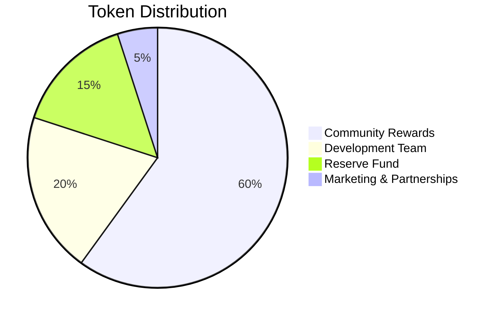

# 💎 EVcoin Tokenization System

The EVcoin tokenization system is the heart of our platform, providing sustainable charging incentives through blockchain technology and creating a comprehensive ecosystem for EV drivers.

## 📋 Table of Contents

- [Overview](#overview)
- [Token Economics](#token-economics)
- [Reward Mechanisms](#reward-mechanisms)
- [Blockchain Integration](#blockchain-integration)
- [Wallet Management](#wallet-management)
- [Smart Contracts](#smart-contracts)
- [API Integration](#api-integration)
- [Security](#security)
- [Examples](#examples)

---

## 🌟 Overview

EVcoin (EVC) is an ERC-20 compatible utility token designed to incentivize sustainable electric vehicle charging behavior. The token system rewards users for:

- **🌱 Green Energy Charging** - Extra rewards for renewable energy
- **⏰ Off-Peak Charging** - Incentives for charging during low-demand periods
- **🏆 Loyalty Program** - Tiered rewards based on usage
- **🤝 Community Participation** - Referrals and community challenges
- **♻️ Carbon Reduction** - Rewards for environmental impact

### Key Features

- **ERC-20 Compatible** - Works with all Ethereum wallets
- **Multi-Chain Support** - Deployed on multiple blockchains
- **Instant Rewards** - Real-time token distribution
- **Deflationary Model** - Token burning mechanism
- **Governance Rights** - Voting power for platform decisions

---

## 💰 Token Economics

### Token Specifications

| Parameter | Value |
|-----------|-------|
| **Token Name** | EVcoin |
| **Token Symbol** | EVC |
| **Token Standard** | ERC-20 |
| **Total Supply** | 1,000,000,000 EVC |
| **Decimals** | 18 |
| **Initial Price** | $0.01 USD |

### Distribution Model



#### Distribution Breakdown

- **Community Rewards (60%)** - 600,000,000 EVC
  - Charging session rewards
  - Referral bonuses
  - Community challenges
  - Staking rewards

- **Development Team (20%)** - 200,000,000 EVC
  - 4-year vesting period
  - Performance-based unlocks
  - Development milestones

- **Reserve Fund (15%)** - 150,000,000 EVC
  - Platform development
  - Emergency fund
  - Future partnerships

- **Marketing & Partnerships (5%)** - 50,000,000 EVC
  - Exchange listings
  - Marketing campaigns
  - Strategic partnerships

### Token Utility

#### Primary Uses
- **Payment Method** - Pay for charging sessions with tokens
- **Station Discounts** - Exclusive discounts for token holders
- **Premium Features** - Access to advanced platform features
- **Governance** - Vote on platform development decisions

#### Secondary Uses
- **Staking Rewards** - Earn additional tokens by staking
- **Liquidity Mining** - Provide liquidity for token rewards
- **NFT Marketplace** - Purchase EV-related digital collectibles
- **Carbon Credits** - Trade carbon offset credits

---

## 🎁 Reward Mechanisms

### Charging Session Rewards

#### Base Reward Calculation
```typescript
interface ChargingReward {
  energyDelivered: number;    // kWh delivered
  baseRate: number;           // Base tokens per kWh
  greenMultiplier: number;    // Green energy bonus
  offPeakMultiplier: number;  // Off-peak bonus
  tierMultiplier: number;     // User tier bonus
  totalReward: number;        // Final reward amount
}

const calculateReward = (session: ChargingSession): ChargingReward => {
  const baseReward = session.energyDelivered * 10; // 10 EVC per kWh
  
  let totalReward = baseReward;
  
  // Green energy bonus (50% extra)
  if (session.isGreenEnergy) {
    totalReward *= 1.5;
  }
  
  // Off-peak bonus (20% extra)
  if (session.isOffPeak) {
    totalReward *= 1.2;
  }
  
  // Tier multiplier
  const tierMultipliers = {
    bronze: 1.0,
    silver: 1.1,
    gold: 1.3,
    platinum: 1.5
  };
  
  totalReward *= tierMultipliers[session.userTier];
  
  return {
    energyDelivered: session.energyDelivered,
    baseRate: 10,
    greenMultiplier: session.isGreenEnergy ? 1.5 : 1.0,
    offPeakMultiplier: session.isOffPeak ? 1.2 : 1.0,
    tierMultiplier: tierMultipliers[session.userTier],
    totalReward: Math.floor(totalReward)
  };
};
```

#### Reward Tiers

| Tier | Requirements | Multiplier | Benefits |
|------|-------------|------------|----------|
| **Bronze** | 0-10 sessions | 1.0x | Basic rewards |
| **Silver** | 11-50 sessions | 1.1x | +10% rewards |
| **Gold** | 51-200 sessions | 1.3x | +30% rewards |
| **Platinum** | 200+ sessions | 1.5x | +50% rewards |

### Special Rewards

#### Green Energy Bonus
- **Renewable Energy Sources** - Solar, wind, hydro
- **Bonus Rate** - 50% extra tokens
- **Verification** - Blockchain-verified energy source
- **Impact Tracking** - Carbon footprint reduction

#### Off-Peak Charging
- **Time Windows** - 11 PM - 6 AM, 1 PM - 4 PM
- **Bonus Rate** - 20% extra tokens
- **Grid Optimization** - Reduces peak demand
- **Smart Scheduling** - AI-powered recommendations

#### Referral Program
```typescript
interface ReferralReward {
  referrerReward: number;    // Tokens for referrer
  refereeReward: number;     // Tokens for new user
  sessionThreshold: number;  // Sessions needed for full reward
}

const referralRewards: ReferralReward = {
  referrerReward: 100,       // 100 EVC for referrer
  refereeReward: 50,         // 50 EVC for new user
  sessionThreshold: 5        // After 5 sessions
};
```

#### Community Challenges
- **Monthly Challenges** - Platform-wide sustainability goals
- **Participation Rewards** - Tokens for joining challenges
- **Achievement Bonuses** - Extra rewards for completing challenges
- **Leaderboards** - Top performers get additional rewards

---

## ⛓️ Blockchain Integration

### Supported Blockchains

| Blockchain | Status | Contract Address | Explorer |
|------------|--------|------------------|----------|
| **Ethereum** | ✅ Active | `0x742d35Cc...` | [Etherscan](https://etherscan.io) |
| **Polygon** | ✅ Active | `0x742d35Cc...` | [Polygonscan](https://polygonscan.com) |
| **BSC** | ✅ Active | `0x742d35Cc...` | [BSCScan](https://bscscan.com) |
| **Arbitrum** | 🔄 Coming Soon | TBD | TBD |

### Smart Contract Architecture

```solidity
// EVcoin Token Contract (Simplified)
contract EVcoinToken is ERC20, Ownable {
    uint256 public constant MAX_SUPPLY = 1_000_000_000 * 10**18;
    uint256 public constant REWARD_RATE = 10 * 10**18; // 10 EVC per kWh
    
    mapping(address => uint256) public userRewards;
    mapping(address => uint256) public lastClaimTime;
    
    // Reward distribution
    function distributeReward(
        address user,
        uint256 energyDelivered,
        bool isGreenEnergy,
        bool isOffPeak,
        uint256 tierMultiplier
    ) external onlyOwner {
        uint256 baseReward = energyDelivered * REWARD_RATE;
        uint256 totalReward = baseReward;
        
        if (isGreenEnergy) {
            totalReward = totalReward * 150 / 100; // 50% bonus
        }
        
        if (isOffPeak) {
            totalReward = totalReward * 120 / 100; // 20% bonus
        }
        
        totalReward = totalReward * tierMultiplier / 100;
        
        userRewards[user] += totalReward;
        emit RewardDistributed(user, totalReward, energyDelivered);
    }
    
    // Claim rewards
    function claimRewards() external {
        uint256 reward = userRewards[msg.sender];
        require(reward > 0, "No rewards to claim");
        
        userRewards[msg.sender] = 0;
        _mint(msg.sender, reward);
        
        emit RewardsClaimed(msg.sender, reward);
    }
}
```

### Cross-Chain Bridge

```typescript
interface CrossChainBridge {
  sourceChain: string;
  targetChain: string;
  amount: number;
  fee: number;
  estimatedTime: number;
}

const bridgeTokens = async (
  amount: number,
  fromChain: string,
  toChain: string
): Promise<CrossChainBridge> => {
  const bridgeFee = amount * 0.001; // 0.1% bridge fee
  const estimatedTime = 15; // 15 minutes
  
  return {
    sourceChain: fromChain,
    targetChain: toChain,
    amount: amount - bridgeFee,
    fee: bridgeFee,
    estimatedTime
  };
};
```

---

## 💼 Wallet Management

### Supported Wallets

#### Web3 Wallets
- **MetaMask** - Browser extension wallet
- **WalletConnect** - Mobile wallet connection
- **Coinbase Wallet** - Coinbase's Web3 wallet
- **Trust Wallet** - Multi-chain mobile wallet

#### Mobile Wallets
- **EVcoin Wallet** - Native mobile wallet
- **MetaMask Mobile** - Mobile MetaMask app
- **Trust Wallet** - Multi-chain mobile wallet
- **Rainbow** - Ethereum-focused mobile wallet

### Wallet Integration

```typescript
import { ethers } from 'ethers';
import { EVcoinToken } from './contracts/EVcoinToken';

class EVcoinWallet {
  private provider: ethers.providers.Web3Provider;
  private signer: ethers.Signer;
  private tokenContract: EVcoinToken;
  
  constructor(provider: ethers.providers.Web3Provider) {
    this.provider = provider;
    this.signer = provider.getSigner();
    this.tokenContract = new ethers.Contract(
      '0x742d35Cc6634C0532925a3b8D4C9db96C4b4d8b6',
      EVcoinToken.abi,
      this.signer
    );
  }
  
  async getBalance(): Promise<number> {
    const balance = await this.tokenContract.balanceOf(
      await this.signer.getAddress()
    );
    return parseFloat(ethers.utils.formatEther(balance));
  }
  
  async claimRewards(): Promise<string> {
    const tx = await this.tokenContract.claimRewards();
    await tx.wait();
    return tx.hash;
  }
  
  async transfer(to: string, amount: number): Promise<string> {
    const tx = await this.tokenContract.transfer(
      to,
      ethers.utils.parseEther(amount.toString())
    );
    await tx.wait();
    return tx.hash;
  }
}
```

### Security Features

#### Multi-Signature Wallets
- **Enterprise Security** - Multi-sig for large token holders
- **Threshold Signatures** - Configurable signature requirements
- **Hardware Integration** - Ledger and Trezor support

#### Key Management
- **Hardware Wallets** - Ledger, Trezor integration
- **Biometric Security** - Fingerprint and face recognition
- **Backup Recovery** - Secure seed phrase management

---

## 🔧 API Integration

### Token Balance API

```http
GET /api/v1/tokens/balance
Authorization: Bearer <token>
```

**Response:**
```json
{
  "success": true,
  "data": {
    "balance": 12500.50,
    "currency": "EVC",
    "walletAddress": "0x742d35Cc6634C0532925a3b8D4C9db96C4b4d8b6",
    "pendingRewards": 150.25,
    "totalEarned": 15000.75,
    "totalSpent": 2500.25,
    "tier": "gold",
    "multiplier": 1.3
  }
}
```

### Reward Calculation API

```http
POST /api/v1/tokens/rewards/calculate
Authorization: Bearer <token>
Content-Type: application/json

{
  "energyDelivered": 25.5,
  "isGreenEnergy": true,
  "isOffPeak": false,
  "userTier": "gold"
}
```

**Response:**
```json
{
  "success": true,
  "data": {
    "baseReward": 255.00,
    "greenBonus": 127.50,
    "tierMultiplier": 1.3,
    "totalReward": 497.25,
    "breakdown": {
      "energyReward": 255.00,
      "greenEnergyBonus": 127.50,
      "loyaltyBonus": 114.75
    }
  }
}
```

### Transaction History API

```http
GET /api/v1/tokens/transactions?type=reward&limit=20
Authorization: Bearer <token>
```

**Response:**
```json
{
  "success": true,
  "data": {
    "transactions": [
      {
        "id": "tx_123",
        "type": "reward",
        "amount": 25.50,
        "description": "Charging session reward",
        "timestamp": "2024-01-07T10:30:00Z",
        "status": "completed",
        "sessionId": "session_123"
      }
    ],
    "totalCount": 45,
    "hasMore": true
  }
}
```

---

## 🔒 Security

### Smart Contract Security

#### Audits
- **CertiK Audit** - Comprehensive security audit
- **ConsenSys Diligence** - Smart contract review
- **OpenZeppelin** - Security best practices
- **Bug Bounty Program** - Community security testing

#### Security Features
- **Pausable Contract** - Emergency pause functionality
- **Access Control** - Role-based permissions
- **Reentrancy Protection** - Prevents reentrancy attacks
- **Integer Overflow Protection** - Safe math operations

### Wallet Security

#### Best Practices
- **Hardware Wallets** - Use Ledger or Trezor for large amounts
- **Multi-Signature** - Require multiple signatures for transactions
- **Regular Backups** - Backup seed phrases securely
- **Phishing Protection** - Verify all transaction details

#### Recovery Options
- **Seed Phrase Backup** - 12/24 word recovery phrase
- **Social Recovery** - Trusted contacts for recovery
- **Hardware Backup** - Physical backup devices
- **Custodial Options** - Institutional custody services

---

## 📚 Examples

### Complete Token Integration Example

```typescript
import { EVcoinAPI } from '@evcoin/sdk';
import { ethers } from 'ethers';

class EVcoinTokenManager {
  private api: EVcoinAPI;
  private wallet: EVcoinWallet;
  
  constructor(apiKey: string, provider: ethers.providers.Web3Provider) {
    this.api = new EVcoinAPI({ apiKey });
    this.wallet = new EVcoinWallet(provider);
  }
  
  async startChargingSession(sessionData: ChargingSessionData) {
    // Start charging session
    const session = await this.api.charging.startSession(sessionData);
    
    // Monitor session for rewards
    this.monitorSession(session.sessionId);
    
    return session;
  }
  
  private async monitorSession(sessionId: string) {
    const ws = new WebSocket(`wss://api.evcoin.io/ws?token=${this.api.token}`);
    
    ws.onmessage = async (event) => {
      const data = JSON.parse(event.data);
      
      if (data.type === 'charging_session_update') {
        console.log('Session update:', data.data);
      }
      
      if (data.type === 'token_reward') {
        console.log('Token reward:', data.data);
        await this.claimRewards();
      }
    };
  }
  
  async claimRewards(): Promise<string> {
    // Claim rewards from smart contract
    const txHash = await this.wallet.claimRewards();
    
    // Update API with transaction
    await this.api.tokens.updateTransaction(txHash);
    
    return txHash;
  }
  
  async getTokenBalance(): Promise<TokenBalance> {
    const [apiBalance, walletBalance] = await Promise.all([
      this.api.tokens.getBalance(),
      this.wallet.getBalance()
    ]);
    
    return {
      apiBalance: apiBalance.data.balance,
      walletBalance,
      pendingRewards: apiBalance.data.pendingRewards
    };
  }
}

// Usage example
const provider = new ethers.providers.Web3Provider(window.ethereum);
const tokenManager = new EVcoinTokenManager('your-api-key', provider);

// Start charging session
const session = await tokenManager.startChargingSession({
  stationId: 'station_123',
  connectorId: 'connector_123',
  vehicleId: 'vehicle_123'
});

// Get token balance
const balance = await tokenManager.getTokenBalance();
console.log('Token balance:', balance);
```

### React Hook Example

```typescript
import { useState, useEffect } from 'react';
import { useEVcoinTokens } from '@evcoin/react-hooks';

function TokenDashboard() {
  const { balance, transactions, claimRewards, isLoading } = useEVcoinTokens();
  
  return (
    <div className="token-dashboard">
      <div className="balance-card">
        <h2>EVcoin Balance</h2>
        <div className="balance-amount">
          {balance?.balance?.toFixed(2)} EVC
        </div>
        <div className="pending-rewards">
          Pending: {balance?.pendingRewards?.toFixed(2)} EVC
        </div>
      </div>
      
      <div className="recent-transactions">
        <h3>Recent Transactions</h3>
        {transactions?.map(tx => (
          <div key={tx.id} className="transaction-item">
            <span className="amount">+{tx.amount} EVC</span>
            <span className="description">{tx.description}</span>
            <span className="timestamp">{tx.timestamp}</span>
          </div>
        ))}
      </div>
      
      <button 
        onClick={claimRewards}
        disabled={isLoading || !balance?.pendingRewards}
        className="claim-button"
      >
        Claim Rewards
      </button>
    </div>
  );
}
```

---

## 🚀 Getting Started

### 1. Connect Wallet
```typescript
// Connect to MetaMask
const provider = new ethers.providers.Web3Provider(window.ethereum);
await provider.send("eth_requestAccounts", []);
```

### 2. Initialize API
```typescript
const api = new EVcoinAPI({
  apiKey: 'your-api-key',
  environment: 'production'
});
```

### 3. Start Earning Tokens
```typescript
// Start charging session
const session = await api.charging.startSession({
  stationId: 'station_123',
  connectorId: 'connector_123'
});

// Tokens will be automatically distributed
```

---

## 📞 Support

- **Token Support**: [token-support@evcoin.io](mailto:token-support@evcoin.io)
- **Smart Contract Issues**: [GitHub Issues](https://github.com/mercuria-tech/evcoin/issues)
- **Community**: [Discord](https://discord.gg/evcoin)
- **Documentation**: [docs.evcoin.io](https://docs.evcoin.io)

---

<div align="center">

**💎 Comprehensive Tokenization System for Sustainable EV Charging**

[API Reference](api/README.md) • [Smart Contracts](smart-contracts.md) • [Examples](examples/) • [Security](security.md)

</div>
